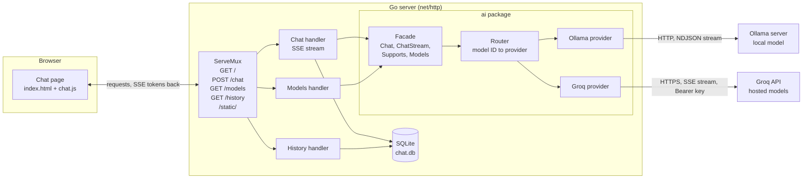
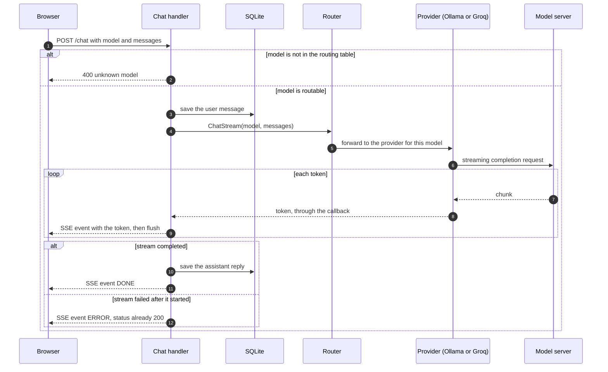

# go-ollama-chat

A real-time, streaming AI chat app: **Go** on the backend, a **local LLM via [Ollama](https://ollama.com)** for inference, and a dependency-light frontend. Replies stream into the browser token-by-token over Server-Sent Events. Runs fully local and private by default. Groq is optional.


-000000)


## Features

- **Live token streaming**: replies appear as they're generated, via SSE (`text/event-stream`) with per-token HTTP flushing.
- **Polished chat UI**: auto-growing prompt box, role-based message bubbles, auto-scroll, and a scroll-to-bottom control.
- **Markdown rendering**: assistant replies render as formatted markdown (code blocks, lists) once complete, sanitized against XSS (via `marked` + `DOMPurify`).
- **Stop generation**: cancel a streaming reply mid-flight (browser `AbortController` → the server stops cleanly).
- **Local and private by default**: with Ollama, prompts never leave your machine and no API key is needed. Groq is an optional hosted provider (see "Models and providers").
- **Persistent**: conversations are saved to SQLite and restored on refresh.
- **Lean backend**: Go standard library plus one pure-Go SQLite driver (no CGO, no C toolchain).

## Stack

| Layer     | Tech                            |
|-----------|---------------------------------|
| Backend   | Go (`net/http`, stdlib)         |
| LLM       | Ollama (`llama3.2:3b`, local) and Groq (optional, hosted), routed by model |
| Transport | Server-Sent Events (SSE)        |
| Storage   | SQLite (pure-Go `modernc.org/sqlite`) |
| Frontend  | Vanilla JS + CSS                |

## How it works

The browser sends the whole conversation and a model ID. The Go server checks the model against its routing table, sends the conversation to the provider that serves that model, and relays each token to the browser over Server-Sent Events as it arrives. All model communication lives in the `ai` package, so handlers never know which provider answers.

### Architecture



### A chat message, step by step

The model check happens before anything is saved or sent upstream, so a rejected request leaves no trace. Once the first token is sent, the HTTP status is already 200, so a later failure is reported inside the stream.



## Prerequisites

- [Go 1.25+](https://go.dev/dl/)
- [Ollama](https://ollama.com), running locally

## Quick start

```bash
git clone https://github.com/StphnLwnga/go-ollama-chat
cd go-ollama-chat

# Pull the default model (first run only, ~2 GB)
ollama pull llama3.2:3b

# Optional: copy the example settings (add GROQ_API_KEY for hosted models)
cp .env.example .env

# Run
make run            # or: go run .
# → http://localhost:8080
```

## Models and providers

Each message goes to the provider that serves its model, through a routing table built at startup.

| Models                                                          | Provider                           | Available                     |
|-----------------------------------------------------------------|------------------------------------|-------------------------------|
| `OLLAMA_MODEL` (default `llama3.2:3b`)                          | Ollama (local)                     | always                        |
| `openai/gpt-oss-20b`, `openai/gpt-oss-120b`, `qwen/qwen3.8-27b` | [Groq](https://groq.com) (hosted)  | when `GROQ_API_KEY` is set    |

Without `GROQ_API_KEY`, the app starts with the local model only and logs that Groq is off.

`GET /models` returns the available model names as JSON, and the page builds its model list from it. A message for a model that is not in the table gets a `400` before anything is saved or sent to a provider.

The models Groq offers depend on the account. To list the models your key can use:

```bash
curl -s https://api.groq.com/openai/v1/models -H "Authorization: Bearer $GROQ_API_KEY"
```

A new Groq model must also be added to the routing table in `main.go` before the app sends messages to it.

Each call to a provider has a time limit per phase but none on the whole request, because an answer can stream for minutes. A provider has 5 s to connect (10 s for the TLS handshake) and a first-byte budget to start answering: 1 minute for Ollama, which covers a cold start, and 15 s for Groq. The server closes a connection that takes more than 5 s to send its headers or 30 s to send its request, and closes an idle connection after 2 minutes. Each streamed event has 10 s to be written, so a client that stops reading cannot hold the handler; the server has no `WriteTimeout`, because a limit on the whole response would cut off every streamed answer.

## Configuration

The app reads its settings once, at startup. If any setting is invalid, it stops and lists every invalid setting at once.

| Setting           | Default                   | Rule                                                        |
|-------------------|---------------------------|-------------------------------------------------------------|
| `PORT`            | `8080`                    | a number from 1 to 65535                                    |
| `DB_PATH`         | `chat.db`                 | must not be empty                                           |
| `OLLAMA_BASE_URL` | `http://localhost:11434`  | an `http` or `https` URL with a host                        |
| `OLLAMA_MODEL`    | `llama3.2:3b`             | must not be empty; the local model the router serves        |
| `GROQ_API_KEY`    | none                      | optional; adds Groq's models when set; never printed in logs |

Settings come from three places, highest priority first:

1. Environment variables set in the shell, for example `PORT=9090 go run .`
2. A `.env` file in the working directory, loaded at startup if it exists (copy `.env.example`)
3. The defaults above

A missing `.env` file is fine. A `.env` file that exists but cannot be read stops the app with the reason. The startup log prints the loaded settings, with the Groq key shown as `[redacted]`, or `[not set]` when it is empty.

## HTTP routes

| Route          | What it does                                                                   |
|----------------|--------------------------------------------------------------------------------|
| `GET /`        | The chat page                                                                  |
| `POST /chat`   | Streams a reply to the conversation as Server-Sent Events; `400` for an unknown model |
| `GET /models`  | The model IDs the router can serve, as a JSON array                            |
| `GET /history` | The saved conversation, as JSON                                                |
| `/static/`     | CSS and JavaScript files                                                       |

## Measured results

Same prompt, three runs each, measured on 2026-09-29. Local runs used an Apple M4 with 16 GB of memory; Groq runs on Groq's own hardware.

| Run                              | First token    | Total          |
|----------------------------------|----------------|----------------|
| local llama3.2:3b, cold start    | 5.6 s          | 7.8 s          |
| local llama3.2:3b, warm          | 0.03 to 0.05 s | 2.3 to 2.5 s   |
| Groq gpt-oss-20b                 | 0.39 to 0.53 s | 0.49 to 0.71 s |
| Groq, network only (error reply) | 0.17 to 0.25 s | same           |

The local model returns the first token sooner, but Groq finishes about 15 times faster. The answers have different lengths, so tokens per second is the fair comparison; the app does not count tokens yet.

To repeat a run, start the app and replace `<model>` with a model name:

```bash
curl -s -N -o /dev/null -X POST localhost:8080/chat -H 'Content-Type: application/json' -d '{"model":"<model>","messages":[{"role":"user","content":"Explain what an HTTP status code is in three sentences."}]}' -w 'first token %{time_starttransfer}s, total %{time_total}s\n'
```

### Cancellation and timeouts

Measured on 2026-10-02 with local llama3.2:3b on the same Apple M4.

- **The client gives up during prefill** (a 26 KB prompt, the client gives up at 1.5 s): before this change, Ollama ran on for 17.3 s and the cut-off reply was saved as complete. Now Ollama stops at 1.67 s, and nothing is saved.
- **The client gives up mid-stream** (at 4 s): Ollama stops at about 4.0 s, and nothing is saved.
- **Cold start**: the first token came after 4.52 s (the table's 5.6 s is from 2026-09-29). With a 1 s first-byte budget, every cold start fails with `timeout awaiting response headers`, which is why the local budget is 1 minute.
- **Slow headers**: before, a connection that sent its headers slowly was still open after 20 s. Now the server closes it at 5.00 s.
- **A long answer**: a 33.3 s streamed answer completes with the 30 s `ReadTimeout` in place.

## Project layout

```bash
main.go                Startup: loads .env and settings, builds the router, registers routes
config/config.go       Settings: loaded once at startup, with defaults, validation and a redacted secret type
readme_test.go         Fails CI when the README misses a setting, route or package
ai/provider.go         Provider interface + package facade; handlers call only this package
ai/router.go           Routing table: sends each model to the provider that serves it
ai/ollama.go           Ollama provider (local)
ai/groq.go             Groq provider (hosted, needs GROQ_API_KEY)
ai/client.go           HTTP client for providers: a timeout per phase, none on the whole request
db/db.go               SQLite persistence: saves and loads the conversation
handlers/chat.go       The SSE streaming chat endpoint
handlers/history.go    Serves the saved conversation as JSON
handlers/models.go     Serves the available model names as JSON
handlers/handlers.go   Page handler
sse/sse.go             Server-Sent Events writer with a write deadline per event
templates/index.html   Chat UI
static/                style.css + chat.js
```
